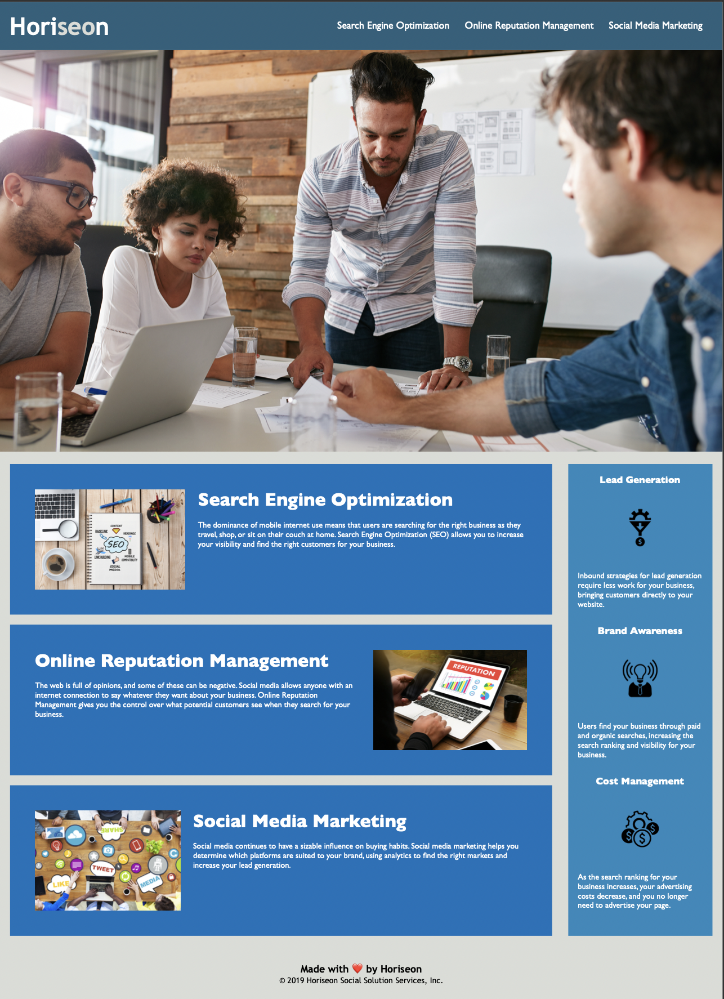

# 01 Code Refactor_YMS

Bootcamp homework - 01 HTML, CSS, Git: Code Refactor

## The Challenge

The challenge consisted of refactoring the existing webpage in order to make it accessible for the users and optimized for search engines.

### Acceptance Criteria

  * Meets accessibility standards
  * Applies semantic HTML elements
  * Follows a logical structure independent of styling and positioning
  * Images include an alt attribute
  * Heading atr falls in sequential order
  * Includes a discriptive title element 
  * Ensures links are functional
  * Clean up CSS selectors and properties
  * Include comments before each element or section
  

## Process

To accomplish this challenge the following steps are to be done:

  * Understand the webpage purpose, content and the User's needs
  * Research sources to understand concepts
    * What is code refactoring?
    * What are semantic HTML elements?
    * What are web accesibility standards?
    * How to make a proper README file

  * Apply the above cocepts when revising and editing the HTML and CSS file
  
The modifications and findings to the HTML file

      Stucture and Descriptive comments were added
      <!-- Header -->
      <!-- Main Content -->
      <!-- Additional indirect content -->
      <!-- Footer -->
    
    Changed the title to "Business Digital Website
    Changed 
 for <Header> tag
    Changed 
 for <nav> tag

    Added <Main> tag to group the the main content 
    Added <section> tag within the main content to identify each section on the webpage

    Added <aside> tag to group the additional indirect content
    Added <section> tag, similarly to main

    Added <footer> tag at the bottom of the page

    Included alt properties to each image
    Included class to id for search-engine-otimization, online-reputation-management, social-media-marketing
    Changed class to id for benefit-lead, benefit-brand, and benefit cost

The modifications and findings to the CSS file

    Comments were added to the CSS file and the css rules were clasified accordingly:

    Rules simplified:

    #benefit-lead,
    #benefit-brand,
    #benefit-cost {
    margin-bottom: 32px;
    color: #ffffff;
    }

    #benefit-lead h3,
    #benefit-brand h3,
    #benefit-cost h3 {
    margin-bottom: 10px;
    text-align: center;
    }   

    #benefit-lead img,
    #benefit-brand img,
    #benefit-cost img {
    display: block;
    margin: 10px auto;
    max-width: 150px;
    }

    #search-engine-optimization, 
    #online-reputation-management, 
    #social-media-marketing {
    margin-bottom: 20px;
    padding: 50px;
    height: 300px;
    font-family: 'Gill Sans', 'Gill Sans MT', 'Calibri', 'Trebuchet MS', sans-serif;
    background-color: #0072bb;
    color: #ffffff;
    }

    #search-engine-optimization img,
    #online-reputation-management img,
    #social-media-marketing img {
    max-height: 200px;
    }

    #search-engine-optimization h2,
    #online-reputation-management h2,
    #social-media-marketing h2 {
    margin-bottom: 20px;
    font-size: 36px;
    }

## The output
   
With research and application of specific changes, an accessible project was ensured.

## Installation

The project was uploaded to Github at the following respsitory: 
https://github.com/Yeraldi-Mendez/Challenge1.git

You can access the deployed application with the Github pages link:
https://yeraldi-mendez.github.io/Challenge1/

## Aknowledgements

This homework project was conducted by Yeraldi Mendez Solano under the supervision of UCI coding bootcamp FALL 2022
